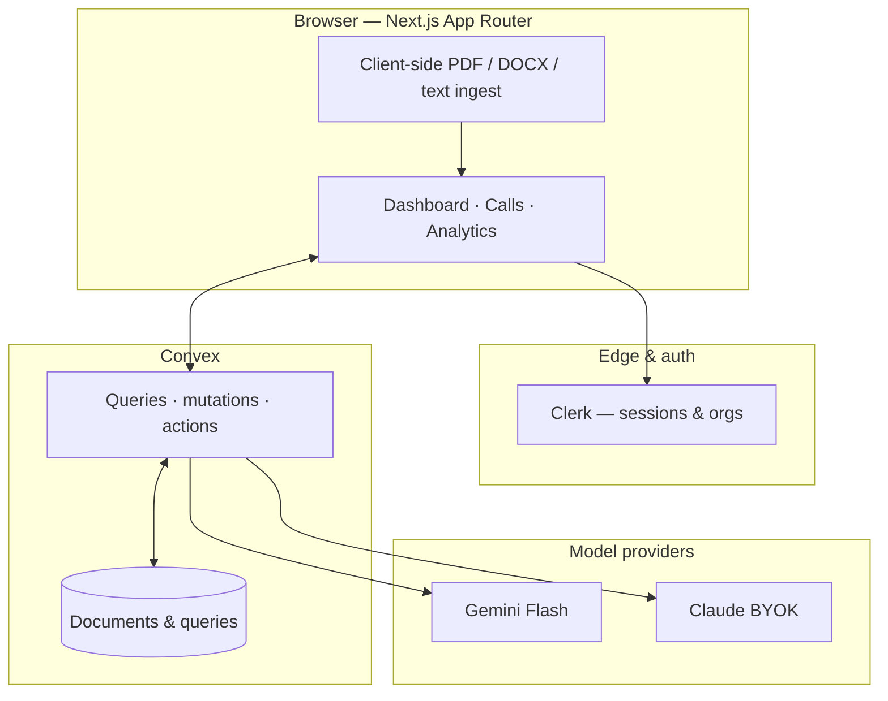

<p align="center">
  <br />
  <samp><strong style="font-size:1.35em; letter-spacing:0.35em;">P I T C H L Y</strong></samp>
  <br /><br />
  <strong>AI sales manager for B2B teams</strong><br />
  <sub>Upload call transcripts · get summaries, scores, objections, and coaching · roll up to team analytics</sub>
  <br /><br />
  <a href="https://nextjs.org/"></a>
  &nbsp;
  <a href="https://react.dev/"></a>
  &nbsp;
  <a href="https://www.convex.dev/"></a>
  &nbsp;
  <a href="https://www.typescriptlang.org/"></a>
  &nbsp;
  <a href="https://pnpm.io/"></a>
</p>

<br />

<p align="center">
  <a href="#quick-start">Quick start</a>
  &nbsp;·&nbsp;
  <a href="#architecture">Architecture</a>
  &nbsp;·&nbsp;
  <a href="#documentation">Documentation</a>
  &nbsp;·&nbsp;
  <a href="#scripts">Scripts</a>
</p>

<br />

---

## Quick start

> [!TIP]
> This repo uses **pnpm**. Install dependencies once, then run the dev server.

```bash
pnpm install
pnpm dev
```

Open [http://localhost:3000](http://localhost:3000). Configure Clerk and Convex via `.env.local` — see **[docs/DEPLOYMENT.md](docs/DEPLOYMENT.md)** for environment variables and hosting notes.

---

## Architecture

High-level data flow: **Clerk** gates the Next.js app; **Convex** is the system of record and realtime layer; **Gemini / Claude** power structured analysis on demand.



---

## Documentation

All long-form product and engineering docs live under **`docs/`**. Start with the index:

| | |
| :--- | :--- |
| **[docs/README.md](docs/README.md)** | Hub — what each doc is for |
| **[docs/roadmap.md](docs/roadmap.md)** | Product vision, data model, weekly build order |
| **[docs/UI-OVERHAUL.md](docs/UI-OVERHAUL.md)** | Design tokens, motion, and UI conventions |
| **[docs/PAGES.md](docs/PAGES.md)** | Route map and feature coverage |
| **[docs/DEPLOYMENT.md](docs/DEPLOYMENT.md)** | Env vars, Convex, Clerk, production checklist |
| **[docs/testing.md](docs/testing.md)** | Vitest, Playwright, and Convex test commands |
| **[docs/CLAUDE.md](docs/CLAUDE.md)** | Deep context for AI-assisted development |
| **[docs/AGENTS.md](docs/AGENTS.md)** | Next.js version constraints for agents |

---

## Scripts

| Command | Purpose |
| :--- | :--- |
| `pnpm dev` | Local Next.js dev server |
| `pnpm build` | Production build |
| `pnpm lint` | ESLint |
| `pnpm test` | Vitest unit tests |
| `pnpm test:e2e` | Playwright end-to-end |

---

<p align="center">
  <sub>Built with Convex realtime patterns, Pitchly design tokens, and a focus on manager-ready analytics.</sub>
</p>
